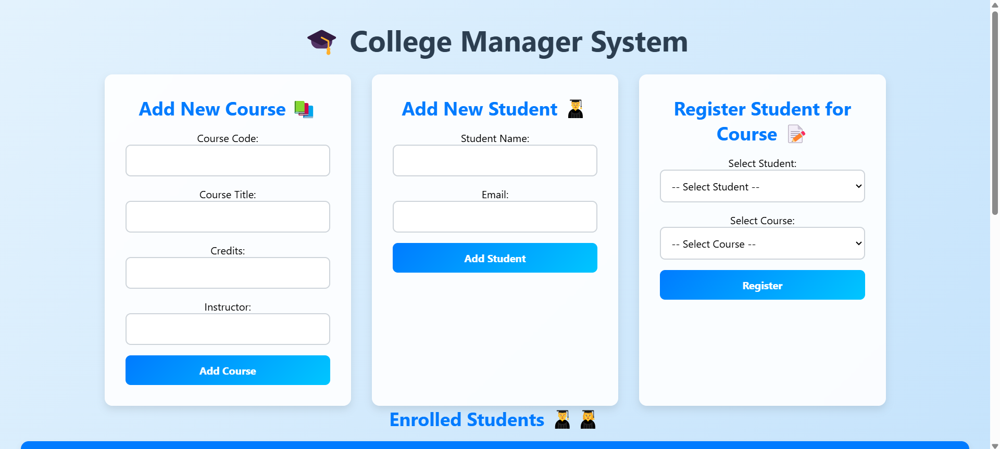

# 🎓 College Management System  

A **Jakarta EE-based web application** designed to manage efficiently **college courses and student records**. This system enables administrators to **add new courses**, **register students**, and track academic operations through a modern, structured, and scalable architecture.

---

## 🚀 Features  
✅ **Add New Courses** – Easily enter course details such as code, title, credits, and instructor.  
✅ **Register Students** – Manage student records with names and email addresses.  
✅ **Dynamic Enrollment** – Assign students to courses and track enrollments.  
✅ **User-Friendly UI** – Clean and modern interface with responsive design.  
✅ **Real-Time Data Management** – Dynamically update student and course records.  
✅ **Admin Dashboard** – View key statistics and analytics of student enrollments.  

---

## 🛠️ Tech Stack  
- **Backend:** Jakarta EE (JAX-RS, CDI, JPA)  
- **Frontend:** HTML, CSS, JSF  
- **Database:** MySQL / PostgreSQL *(To be integrated in future updates)*  
- **Server:** Apache Tomcat  
- **Charting Library:** Chart.js *(for analytics visualization)*  
- **Deployment:** Running on **http://localhost:8080/negar/manager**  

---

## 📸 Screenshots  

### 🔹 **Dashboard & Student Overview**  
  

---

## 🔧 Installation & Setup  

### **1️⃣ Prerequisites**  
Ensure you have the following installed on your system:  
- **Java 11+** (JDK)  
- **Apache Tomcat (or another Jakarta EE-compatible server)**  
- **Maven** (for dependency management)  
- **Git** (for cloning the repository)  

### **2️⃣ Clone the Repository**  
```sh
git clone https://github.com/negarprh/college-management-system.git
cd college-management-system
```

### **3️⃣ Build & Deploy the Application**  
- Deploy the application on a Jakarta EE-compatible server (e.g., **Tomcat**).  
- Access the system at **http://localhost:8080/negar/manager**

---

## 🏗️ Future Improvements  
🔹 **Database Integration** – Store and retrieve data dynamically from **MySQL/PostgreSQL**.  
🔹 **Course-Student Associations** – Enable **course enrollment tracking** 📚.  
🔹 **Authentication & Roles** – Implement **admin, instructor, and student login** 🔑.  
🔹 **Data Validation & Error Handling** – Improve **input validation and error messages**.  
🔹 **Advanced Analytics Dashboard** – Track **student performance and enrollment trends** 📊.  
🔹 **Modern UI Enhancements** – Further **improve design and responsiveness** 🎨.  

---

## 📜 License  
This project is licensed under the **MIT License** – feel free to use, modify, and distribute.  

---

## 📞 Contact  
For any questions or issues, reach out via:  
📧 **Email:** [negarpr@hotmail.com]  
🔗 **GitHub:** [Negar's Profile](https://github.com/negarprh)  
